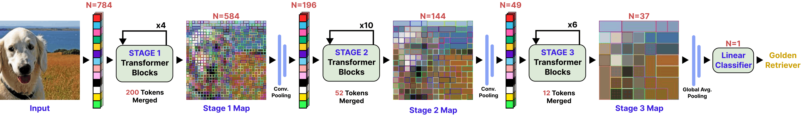

# Combining Recursive Weight-Sharing with Token Merging for Edge Vision Transformers


>University of Twente TCS Bachelor Research Project

Implementation of the paper "(TBD)" (TScIT 45).

**Author:** Junseo Kim <br>
**Supervised by:** dr. ir. Uraz Odyurt & dr. Amirreza Yousefzadeh<br>

## Abstract

Vision Transformers (ViTs) demonstrate exceptional performance in computer vision but suffer from large parameter counts and quadratic computational complexity $O(N^2)$, severely limiting their deployment on resource-constrained edge hardware. While recursive weight-sharing reduces parameter counts and token merging mitigates computational and memory bottlenecks, integrating these two paradigms without costly retraining introduces severe topological and representational clashes, leaving this intersection largely unexplored. We propose a training-free orthogonal compression framework that successfully combines the recursive weight-sharing of the Sliced Recursive Transformer (SReT) with the dynamic token merging algorithm of Token Merging (ToMe). By implementing an unmerge tracking stack, enforcing strict mathematical merging bounds, and applying parallel spatial tracking, our methodology resolves the rigid topological and merging constraints of hierarchical, recursive ViTs. Furthermore, we introduce a novel exponential token reduction schedule to stabilize the semantic densification inherent to recursive loops. Benchmarked on ImageNet-1K, our optimized configuration achieves a 27.6\% increase in throughput and a 38.5\% reduction in peak activation memory with a minimal 1.47\% accuracy drop on a GPU at a batch size of 128. Ultimately, this inference-only approach establishes the feasibility of dynamic token reduction within recursive architectures, providing a structural baseline for future edge-targeted optimizations. 

## Our Approach

- Overview of the proposed compression framework combining [SReT](https://github.com/szq0214/SReT/tree/main) and [ToMe](https://github.com/facebookresearch/ToMe)<br>


- SReT+ToMe Transformer Block<br>


## Results on ImageNet-1K

**Hardware Setup:** 
- GPU metrics measured on an **NVIDIA RTX 4060 Ti**. 
- CPU metrics measured on an **Intel Core Ultra 9 285K** (constrained to four threads).

| Model Configuration | Top-1 Acc. | Params | FLOPs | GPU Thr. BS=128 | GPU Thr. BS=1 | GPU Mem BS=128 | GPU Mem BS=1 | CPU Thr. BS=1 |
| :--- | :---: | :---: | :---: | :---: | :---: | :---: | :---: | :---: |
| **Standard ViT** | | | | | | | | |
| DeiT-Tiny-Distill | 74.40% | 5.91M | 2.17G | 1825.88 | 730.20 | 227.20 MB | 1.76 MB | 141.79 |
| **Recursive ViT** | | | | | | | | |
| SReT-Tiny-Distill | 77.42% | 4.76M | 1.91G | 1072.86 | 223.58 | 795.76 MB | 6.22 MB | 83.32 |
| ↳ *ToMe: Constant* (r=10) | 71.01% (-6.41) | -- | 1.32G (-30.9%) | 1176.27 (+9.6%) | 110.24 (-50.7%) | 769.79 MB (-3.3%) | 6.01 MB (-3.4%) | 75.97 (-8.8%) |
| ↳ *ToMe: Constant* (r=20) | 41.06% (-36.36) | -- | 1.06G (-44.5%) | 1331.23 (+24.1%)| 112.56 (-49.7%) | 756.22 MB (-5.0%) | 5.91 MB (-5.0%) | 83.16 (-0.2%) |
| ↳ *ToMe: Linear* (r=10) | 74.64% (-2.78) | -- | 1.46G (-23.6%) | 1177.32 (+9.7%) | 116.12 (-48.1%) | 756.22 MB (-5.0%) | 5.91 MB (-5.0%) | 73.06 (-12.3%) |
| ↳ *ToMe: Linear* (r=20) | 14.87% (-62.55) | -- | 1.07G (-44.0%) | 1427.14 (+33.0%)| 117.21 (-47.6%) | 729.46 MB (-8.3%) | 5.70 MB (-8.4%) | 85.30 (+2.4%) |
| ↳ **Ours: Exp.** (r=0.1, α=0.6) | 76.35% (-1.07) | -- | 1.61G (-15.7%) | 1186.62 (+10.6%) | 128.30 (-42.6%) | 664.75 MB (-16.5%) | 5.19 MB (-16.6%) | 76.44 (-8.3%) |
| ⭐ **Ours: Exp.** (r=0.25, α=0.0) | **75.95%** (-1.47) | **--** | **1.49G** (-22.0%) | **1368.67** (+27.6%) | **174.37** (-22.0%) | **489.38 MB** (-38.5%) | **3.90 MB** (-37.3%) | **84.15** (+1.0%) |
| ↳ **Ours: Exp.** (r=0.4, α=0.2) | 69.71% (-7.71) | -- | 1.13G (-40.8%) | 1886.90 (+75.9%) | 147.91 (-33.8%) | 391.51 MB (-50.8%) | 3.90 MB (-37.3%) | 88.12 (+5.8%) |

## Repository Structure

```
├── figures/             # Figures
├── images/              # Visualization images
├── logistics/           # CPU Performance Monitor helper
├── plots/               # Evaluation plots               
├── tome/                # Token Merging (ToMe) modules     
├── utilities/           # CPU Performance Monitor script            
├── weights/             # Pre-trained model checkpoints
├── PiT_ToMe.py          # PiT+ToMe integration module
├── SReT_ToMe.py         # SReT+ToMe integration module
├── SReT.py              # Original SReT 
├── eval_cpu.py          # Benchmarking script for CPU environments
├── eval_gpu.py          # Benchmarking script for GPU environments
├── grid_search_cpu.py   # Decay parameter CPU grid search script
├── grid_search_cpu.csv  # CPU grid search results
├── grid_search_gpu.py   # Decay parameter GPU grid search script
├── grid_search_gpu.csv  # GPU grid search results
├── results.ipynb        # Notebook with baseline evaluation results
├── visuals.ipynb        # Notebook for token merging visualization
├── plots.ipynb          # Notebook for plot generation
├── requirements.txt     # Python requirements
├── environment.yml      # Environment
```

## Setup

Requires the official validation set of the ImageNet-1K (ILSVRC 2012) dataset. Path variable `dataset_dir` needs to be updated across scripts. 

`conda env create -f environment.yml`<br>
`conda activate sret-tome-env`<br>

## Usage

`python <eval_gpu.py | eval_cpu.py> <model_name> [--constant-r <int>] [--linear-r <int>] [--initial-r <float>] [--alpha <float>]`
* `<eval_gpu.py | eval_cpu.py>`: The execution environment 
* `<model_name>`: The model to evaluate (`deit`, `deit+tome+c`, `pit`, `pit+tome+c`, `pit+tome+l`, `pit+tome+e`, `sret`, `sret+tome+c`, `sret+tome+l`, `sret+tome+e`)
    - `+c` - constant reduction schedule
    - `+l` - linear reduction schedule
    - `+e` - exponential reduction schedule
* `--constant-r`: Merge rate constant reduction 
* `--linear-r`: Merge rate for linear reduction 
* `--initial-r`: Merge rate for exponential reduction 
* `--alpha`: Decay rate for exponential reduction

## Examples

1. DeiT Baseline Evaluation
```bash
python eval_gpu.py deit
```
<details>
<summary><b>Click to view GPU Output</b></summary>

```bash
==================================================
GPU:                    NVIDIA GeForce RTX 4060 Ti
==================================================

--- DeiT Baseline ---
==================================================
Target Batch Size:                             128
--------------------------------------------------
Top-1 Accuracy:                            74.40 %
Total Parameters:                           5.91 M
Theoretical FLOPs:                          2.17 G
Throughput (BS=128):            1808.88 images/sec
Throughput (BS=64):             1938.01 images/sec
Throughput (BS=32):             2020.95 images/sec
Throughput (BS=16):             2344.48 images/sec
Throughput (BS=1):               728.74 images/sec
Peak Activation Memory (BS=128):         227.20 MB
Peak Activation Memory (BS=64):          113.03 MB
Peak Activation Memory (BS=32):           56.44 MB
Peak Activation Memory (BS=16):           28.59 MB
Peak Activation Memory (BS=1):             1.76 MB
==================================================
```
</details>

<br>

```bash
python eval_cpu.py deit
```
<details>
<summary><b>Click to view CPU Output</b></summary>

```bash
==================================================
CPU:                                        x86_64
==================================================

--- DeiT Baseline ---
==================================================
Target Batch Size:                               1
--------------------------------------------------
Latency:                                   7.09 ms
Throughput:                         140.98 img/sec
==================================================
```
</details>

<br>


2. PiT Constant Reduction Evaluation
```bash
python eval_gpu.py pit+tome+c --constant-r 20
```
<details>
<summary><b>Click to view GPU Output</b></summary>

```bash
==================================================
GPU:                    NVIDIA GeForce RTX 4060 Ti
==================================================

--- PiT + ToMe Constant Reduction Schedule | constant_r = 20.0 ---
==================================================
Target Batch Size:                             128
--------------------------------------------------
Top-1 Accuracy:                            71.09 %
Total Parameters:                           5.10 M
Theoretical FLOPs:                          0.66 G
Throughput (BS=128):            1729.52 images/sec
Throughput (BS=64):             1789.51 images/sec
Throughput (BS=32):             1814.40 images/sec
Throughput (BS=16):             1760.17 images/sec
Throughput (BS=1):               226.63 images/sec
Peak Activation Memory (BS=128):        1193.10 MB
Peak Activation Memory (BS=64):          597.80 MB
Peak Activation Memory (BS=32):          299.43 MB
Peak Activation Memory (BS=16):          150.61 MB
Peak Activation Memory (BS=1):             9.32 MB
==================================================
```
</details>

<br>

```bash
python eval_cpu.py pit+tome+c --constant-r 20
```
<details>
<summary><b>Click to view CPU Output</b></summary>

```bash
==================================================
CPU:                                        x86_64
==================================================

--- PiT + ToMe Constant Reduction Schedule  | constant_r = 20.0 ---
==================================================
Target Batch Size:                               1
--------------------------------------------------
Latency:                                   7.55 ms
Throughput:                         132.46 img/sec
==================================================
```
</details>

<br>


3. SReT Linear Reduction Evaluation
```bash
python eval_gpu.py sret+tome+l --linear-r 10
```
<details>
<summary><b>Click to view GPU Output</b></summary>

```bash
==================================================
GPU:                    NVIDIA GeForce RTX 4060 Ti
==================================================

--- SReT + ToMe Linear Reduction Schedule | linear_r = 10.0 ---
==================================================
Target Batch Size:                             128
--------------------------------------------------
Top-1 Accuracy:                            74.74 %
Total Parameters:                           4.76 M
Theoretical FLOPs:                          1.46 G
Throughput (BS=128):            1178.43 images/sec
Throughput (BS=64):             1280.12 images/sec
Throughput (BS=32):             1332.18 images/sec
Throughput (BS=16):             1215.14 images/sec
Throughput (BS=1):               115.80 images/sec
Peak Activation Memory (BS=128):         756.22 MB
Peak Activation Memory (BS=64):          380.27 MB
Peak Activation Memory (BS=32):          189.15 MB
Peak Activation Memory (BS=16):           94.95 MB
Peak Activation Memory (BS=1):             5.91 MB
==================================================
```
</details>

<br>

```bash
python eval_cpu.py sret+tome+l --linear-r 10
```
<details>
<summary><b>Click to view CPU Output</b></summary>

```bash
==================================================
CPU:                                        x86_64
==================================================

--- SReT + ToMe Linear Reduction Schedule | linear_r = 10.0 ---
==================================================
Target Batch Size:                               1
--------------------------------------------------
Latency:                                  14.16 ms
Throughput:                          70.64 img/sec
==================================================
```
</details>

<br>


4. SReT Exponential Reduction Evaluation
```bash
python eval_gpu.py sret+tome+e --initial-r 0.25 --alpha 0
```
<details>
<summary><b>Click to view GPU Output</b></summary>

```bash
==================================================
GPU:                    NVIDIA GeForce RTX 4060 Ti
==================================================

--- SReT + ToMe Exponential Reduction Schedule | initial_r = 0.25, alpha = 0.0 ---
==================================================
Target Batch Size:                             128
--------------------------------------------------
Top-1 Accuracy:                            75.96 %
Total Parameters:                           4.76 M
Theoretical FLOPs:                          1.49 G
Throughput (BS=128):            1366.58 images/sec
Throughput (BS=64):             1510.21 images/sec
Throughput (BS=32):             1588.08 images/sec
Throughput (BS=16):             1589.04 images/sec
Throughput (BS=1):               175.10 images/sec
Peak Activation Memory (BS=128):         489.45 MB
Peak Activation Memory (BS=64):          245.43 MB
Peak Activation Memory (BS=32):          123.13 MB
Peak Activation Memory (BS=16):           62.34 MB
Peak Activation Memory (BS=1):             3.90 MB
==================================================
```
</details>

<br>

```bash
python eval_cpu.py sret+tome+e --initial-r 0.25 --alpha 0
```
<details>
<summary><b>Click to view CPU Output</b></summary>

```bash
==================================================
CPU:                                        x86_64
==================================================

--- SReT + ToMe Exponential Reduction Schedule | initial_r = 0.25, alpha = 0.0 ---
==================================================
Target Batch Size:                               1
--------------------------------------------------
Latency:                                  11.76 ms
Throughput:                          85.05 img/sec
==================================================
```
</details>


## Code Acknowledgments & Licenses

* ToMe (Token Merging): Meta AI (CC BY-NC 4.0)
* SReT (Sliced Recursive Transformer): Zhiqiang Shen (MIT)
* PiT (Pooling-based Vision Transformer): Naver AI (Apache-2.0)
* DeiT (Data-efficient Image Transformers): Meta AI (Apache-2.0)
* PyTorch Image Models (timm): Ross Wightman (Apache-2.0)
* ImageNet-1K (Image Classification Dataset): Stanford Vision Lab (Custom Non-Commercial)

## Citation

TBD
