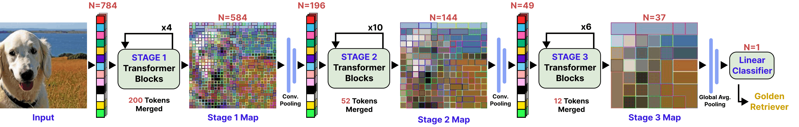
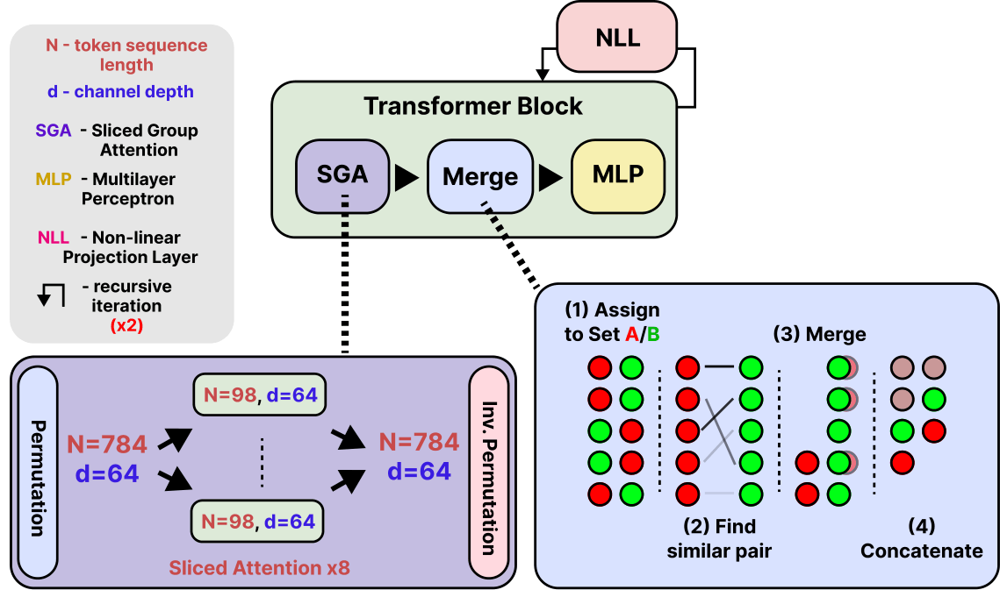

# Combining Recursive Weight-Sharing with Token Merging for Edge Vision Transformers


>University of Twente TCS Bachelor Research Project

Implementation of the paper: [Combining Recursive Weight-Sharing with Token Merging for Edge Vision Transformers]( https://purl.utwente.nl/essays/110754) (TScIT 45).

**Author:** Junseo Kim <br>
**Supervised by:** dr. ir. Uraz Odyurt & dr. Amirreza Yousefzadeh<br>

## Abstract

Vision Transformers (ViTs) demonstrate exceptional performance in computer vision but suffer from large parameter counts and quadratic computational complexity, $\mathcal{O}(N^2)$, severely limiting their deployment on resource-constrained edge hardware. While recursive weight-sharing reduces parameter counts and token merging mitigates computational and memory bottlenecks, integrating these two paradigms without costly retraining is non-trivial, leaving this intersection largely unexplored. We propose a post-training multi-axis compression approach that successfully combines the recursive weight-sharing of the Sliced Recursive Transformer (SReT) with the dynamic token merging algorithm of Token Merging (ToMe). By implementing an unmerge tracking stack, enforcing strict mathematical merging bounds, and applying parallel spatial tracking, our methodology resolves the spatial and merging constraints of the integration. Furthermore, we utilize an exponential token reduction schedule to stabilize the semantic densification inherent to recursive loops. Benchmarked on ImageNet-1K, our optimized configuration achieves a 27.6\% increase in throughput and a 38.5\% reduction in Peak Activation Memory (PAM) with a minimal 1.47\% accuracy drop on a GPU at a batch size of 128. However, the algorithmic overhead negated the performance gains at a batch size of 1. Nevertheless, this approach establishes the feasibility of dynamic token reduction within recursive ViT architectures, providing a structural baseline for future edge-targeted optimizations.

## Our Approach

- Overview of the proposed compression approach combining [SReT](https://github.com/szq0214/SReT/tree/main) and [ToMe](https://github.com/facebookresearch/ToMe)<br>


- SReT+ToMe Transformer Block<br>


## Results on ImageNet-1K

| Model | Acc.<br>(%) | Params.<br>(M) | FLOPs<br>(G) | GPU Throughput<br>(img/s)<br>BS=128 | GPU Peak Memory<br>(MB)<br>BS=128 |
| :--- | :---: | :---: | :---: | :---: | :---: |
| **Standard ViT** | | | | | | 
| DeiT-Tiny-Distill | 74.40 | 5.91 | 2.17 | 1825.88 | 227.20 |
| **Recursive ViT** | | | | | | 
| SReT-Tiny-Distill | 77.42 | 4.76 | 1.91 | 1072.86 | 795.76 |
| ↳ *ToMe: Constant<br>(r=10)* | 71.01 <sub>(-6.41)</sub> | -- | 1.32 <sub>(-30.9%)</sub> | 1176.27 <sub>(+9.6%)</sub> | 769.79 <sub>(-3.3%)</sub> |
| ↳ *ToMe: Linear<br>(r=10)* | 74.64 <sub>(-2.78)</sub> | -- | 1.46 <sub>(-23.6%)</sub> | 1177.32 <sub>(+9.7%)</sub> | 756.22 <sub>(-5.0%)</sub> | 
| ↳ **ToMe: Exponential<br>(r=0.25, α=0.0)** | **75.95** <sub>(-1.47)</sub> | **--** | **1.49** <sub>(-22.0%)</sub> | **1368.67.37** <sub>(+27.6%)</sub> | **489.38** <sub>(-38.5%)</sub> |

- GPU metrics measured on an **NVIDIA RTX 4060 Ti**. 
- CPU metrics measured on an **Intel Core Ultra 9 285K** (constrained to four threads).

## Repository Structure

```
├── figures/             # Figures
├── images/              # Images
├── integration/         # Integration code (SReT, PiT, ToMe)
├── logistics/           # CPU performance snapshot utilities helper
├── notebooks/           # Jupyter notebooks
├── plots/               # Plots               
├── search/              # Grid search code and results (GPU, CPU)               
├── sret/                # Original SReT     
├── tome/                # Original ToMe     
├── utilities/           # CPU performance snapshot utilities           
├── weights/             # Pre-trained model weights
|   ...
├── eval_cpu.py          # CPU evaluation script
├── eval_gpu.py          # GPU evaluation script
├── environment.yml      # Environment
├── requirements.txt     # Python requirements
```

## Dataset Preparation

All evaluations require the official validation set of the **ImageNet-1K (ILSVRC 2012)** dataset. 

1. Download and extract the validation dataset from the [Official ImageNet Website](https://image-net.org/).
2. PyTorch expects the validation images to be organized into class-specific subdirectories. Navigate into the extracted validation folder via terminal and run the standard PyTorch formatting script:
    ```bash
   wget -qO- https://raw.githubusercontent.com/soumith/imagenetloader.torch/master/valprep.sh | bash
3. For running `notebooks/results.ipynb`, update the `dataset_dir` (first cell) variable to the local ImageNet directory.

## Pre-trained Models

Download and place the official baseline weights inside the `weights/` directory before running the evaluation scripts:

* **PiT-Tiny-Distilled:** Download from the [Official PiT Repository](https://github.com/naver-ai/pit)
* **SReT-Tiny-Distilled:** Download from the [Official SReT Repository](https://github.com/szq0214/SReT/tree/main)

>Files must be named `pit_ti_distill_746.pth` and `SReT_T_distill.pth` to match the default paths in the evaluation scripts.

## Environment Setup

`conda env create -f environment.yml`<br>
`conda activate sret-tome-env`<br>

## Usage

`python <eval_gpu.py | eval_cpu.py> <model_name> [--constant-r <int>] [--linear-r <int>] [--initial-r <float>] [--alpha <float>] [--data <str>]`
* `<eval_gpu.py | eval_cpu.py>`: The execution environment 
* `<model_name>`: The model to evaluate (`deit`, `deit+tome+c`, `pit`, `pit+tome+c`, `pit+tome+l`, `pit+tome+e`, `sret`, `sret+tome+c`, `sret+tome+l`, `sret+tome+e`)
    - `+c` - constant reduction schedule
    - `+l` - linear reduction schedule
    - `+e` - exponential reduction schedule
* `--constant-r`: Merge rate constant reduction 
* `--linear-r`: Merge rate for linear reduction 
* `--initial-r`: Merge rate for exponential reduction 
* `--alpha`: Decay rate for exponential reduction
* `--data`: Path to ImageNet dataset (only for `eval_gpu.py`)

## Examples

1. DeiT Baseline Evaluation
```bash
python eval_gpu.py deit
```
<details>
<summary><b>Click to view GPU Output</b></summary>

```bash
==================================================
GPU:                    NVIDIA GeForce RTX 4060 Ti
==================================================

--- DeiT Baseline ---
==================================================
Target Batch Size:                             128
--------------------------------------------------
Top-1 Accuracy:                            74.40 %
Total Parameters:                           5.91 M
Theoretical FLOPs:                          2.17 G
Throughput (BS=128):            1808.88 images/sec
Throughput (BS=64):             1938.01 images/sec
Throughput (BS=32):             2020.95 images/sec
Throughput (BS=16):             2344.48 images/sec
Throughput (BS=1):               728.74 images/sec
Peak Activation Memory (BS=128):         227.20 MB
Peak Activation Memory (BS=64):          113.03 MB
Peak Activation Memory (BS=32):           56.44 MB
Peak Activation Memory (BS=16):           28.59 MB
Peak Activation Memory (BS=1):             1.76 MB
==================================================
```
</details>

<br>

```bash
python eval_cpu.py deit
```
<details>
<summary><b>Click to view CPU Output</b></summary>

```bash
==================================================
CPU:                                        x86_64
==================================================

--- DeiT Baseline ---
==================================================
Target Batch Size:                               1
--------------------------------------------------
Latency:                                   7.09 ms
Throughput:                         140.98 img/sec
==================================================
```
</details>

<br>


2. PiT Constant Reduction Evaluation
```bash
python eval_gpu.py pit+tome+c --constant-r 20
```
<details>
<summary><b>Click to view GPU Output</b></summary>

```bash
==================================================
GPU:                    NVIDIA GeForce RTX 4060 Ti
==================================================

--- PiT + ToMe Constant Reduction Schedule | constant_r = 20.0 ---
==================================================
Target Batch Size:                             128
--------------------------------------------------
Top-1 Accuracy:                            71.09 %
Total Parameters:                           5.10 M
Theoretical FLOPs:                          0.66 G
Throughput (BS=128):            1729.52 images/sec
Throughput (BS=64):             1789.51 images/sec
Throughput (BS=32):             1814.40 images/sec
Throughput (BS=16):             1760.17 images/sec
Throughput (BS=1):               226.63 images/sec
Peak Activation Memory (BS=128):        1193.10 MB
Peak Activation Memory (BS=64):          597.80 MB
Peak Activation Memory (BS=32):          299.43 MB
Peak Activation Memory (BS=16):          150.61 MB
Peak Activation Memory (BS=1):             9.32 MB
==================================================
```
</details>

<br>

```bash
python eval_cpu.py pit+tome+c --constant-r 20
```
<details>
<summary><b>Click to view CPU Output</b></summary>

```bash
==================================================
CPU:                                        x86_64
==================================================

--- PiT + ToMe Constant Reduction Schedule  | constant_r = 20.0 ---
==================================================
Target Batch Size:                               1
--------------------------------------------------
Latency:                                   7.55 ms
Throughput:                         132.46 img/sec
==================================================
```
</details>

<br>


3. SReT Linear Reduction Evaluation
```bash
python eval_gpu.py sret+tome+l --linear-r 10
```
<details>
<summary><b>Click to view GPU Output</b></summary>

```bash
==================================================
GPU:                    NVIDIA GeForce RTX 4060 Ti
==================================================

--- SReT + ToMe Linear Reduction Schedule | linear_r = 10.0 ---
==================================================
Target Batch Size:                             128
--------------------------------------------------
Top-1 Accuracy:                            74.74 %
Total Parameters:                           4.76 M
Theoretical FLOPs:                          1.46 G
Throughput (BS=128):            1178.43 images/sec
Throughput (BS=64):             1280.12 images/sec
Throughput (BS=32):             1332.18 images/sec
Throughput (BS=16):             1215.14 images/sec
Throughput (BS=1):               115.80 images/sec
Peak Activation Memory (BS=128):         756.22 MB
Peak Activation Memory (BS=64):          380.27 MB
Peak Activation Memory (BS=32):          189.15 MB
Peak Activation Memory (BS=16):           94.95 MB
Peak Activation Memory (BS=1):             5.91 MB
==================================================
```
</details>

<br>

```bash
python eval_cpu.py sret+tome+l --linear-r 10
```
<details>
<summary><b>Click to view CPU Output</b></summary>

```bash
==================================================
CPU:                                        x86_64
==================================================

--- SReT + ToMe Linear Reduction Schedule | linear_r = 10.0 ---
==================================================
Target Batch Size:                               1
--------------------------------------------------
Latency:                                  14.16 ms
Throughput:                          70.64 img/sec
==================================================
```
</details>

<br>


4. SReT Exponential Reduction Evaluation
```bash
python eval_gpu.py sret+tome+e --initial-r 0.25 --alpha 0
```
<details>
<summary><b>Click to view GPU Output</b></summary>

```bash
==================================================
GPU:                    NVIDIA GeForce RTX 4060 Ti
==================================================

--- SReT + ToMe Exponential Reduction Schedule | initial_r = 0.25, alpha = 0.0 ---
==================================================
Target Batch Size:                             128
--------------------------------------------------
Top-1 Accuracy:                            75.96 %
Total Parameters:                           4.76 M
Theoretical FLOPs:                          1.49 G
Throughput (BS=128):            1366.58 images/sec
Throughput (BS=64):             1510.21 images/sec
Throughput (BS=32):             1588.08 images/sec
Throughput (BS=16):             1589.04 images/sec
Throughput (BS=1):               175.10 images/sec
Peak Activation Memory (BS=128):         489.45 MB
Peak Activation Memory (BS=64):          245.43 MB
Peak Activation Memory (BS=32):          123.13 MB
Peak Activation Memory (BS=16):           62.34 MB
Peak Activation Memory (BS=1):             3.90 MB
==================================================
```
</details>

<br>

```bash
python eval_cpu.py sret+tome+e --initial-r 0.25 --alpha 0
```
<details>
<summary><b>Click to view CPU Output</b></summary>

```bash
==================================================
CPU:                                        x86_64
==================================================

--- SReT + ToMe Exponential Reduction Schedule | initial_r = 0.25, alpha = 0.0 ---
==================================================
Target Batch Size:                               1
--------------------------------------------------
Latency:                                  11.76 ms
Throughput:                          85.05 img/sec
==================================================
```
</details>


## Code Acknowledgments & Licenses

* CPU Performance Snapshot Utilities: Uraz Odyurt (BSD-3-Clause)
* ToMe (Token Merging): Meta AI (CC BY-NC 4.0)
* SReT (Sliced Recursive Transformer): Zhiqiang Shen (MIT)
* PiT (Pooling-based Vision Transformer): Naver AI (Apache-2.0)
* DeiT (Data-efficient Image Transformers): Meta AI (Apache-2.0)
* PyTorch Image Models (timm): Ross Wightman (Apache-2.0)
* ImageNet-1K (Image Classification Dataset): Stanford Vision Lab (Custom Non-Commercial)

## Acknowledgments

Special thanks to my supervisors, dr. ir. Uraz Odyurt and dr. Amirreza Yousefzadeh, for their guidance throughout this research.

## Citation

```
@mastersthesis{Kim2026,
    month = {July},
    author = {Kim, Junseo},
    year= {2026},
    school= {University of Twente},
    address= {Enschede},
    type= {Thesis},
    title= {Combining Recursive Weight-Sharing with Token Merging for Edge Vision Transformers},
    url= {https://purl.utwente.nl/essays/110754}
}
```
